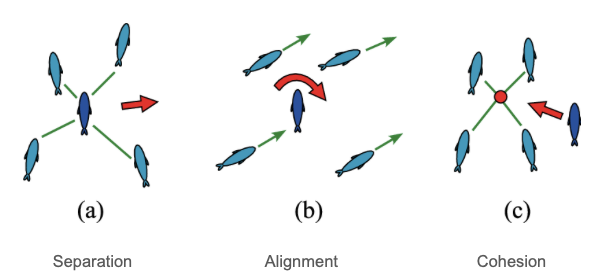
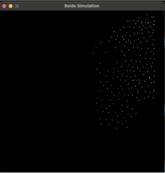
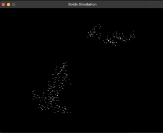
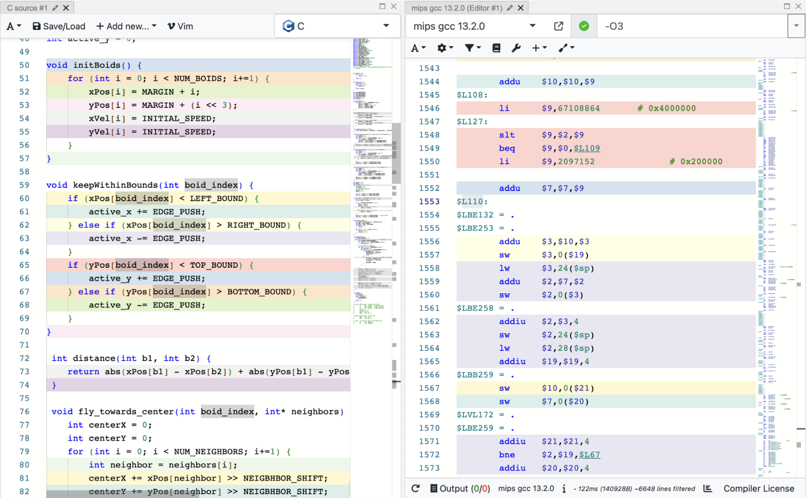

# Final Project - Boid Hardware
> Tate Staples and Shaan Yadav

## Overview
The goal of this project was to build an efficient low level implementation of the [Boid Algorithm](https://en.wikipedia.org/wiki/Boids). The Boid Algorithm is a simple algorithm that simulates the flocking behavior of birds. The algorithm is based on three simple rules:
1. **Separation**: Boids will avoid collisions with other boids.
2. **Alignment**: Boids will try to align their velocities with other boids.
3. **Cohesion**: Boids will try to move towards the center of mass of other boids.

## Boid Alogrithm
The algorithm is simple to implement and can be run in parallel, making it a good candidate for hardware acceleration. We then created a asynchronous double buffer graphics processor to display the boids on a VGA monitor.

## Software
This project was very software heavy, as our project was implementing an algorithm. Due to the complexity of the algorithm, we decided to iterate through multiple implementations to find the most efficient one. 
### Pygame Boids

We started with a simple python implementation. This served the purpose of providing the deepest understanding of the algoirthm, allowed us to discover high level logic errors and do some hyperparameter tuning.

This was a good starting platform because both of us had familiarity with python and the pygame library. This allowed us to quickly prototype the boids algorithm and get a feel for how the boids should behave.

Additionally there were plenty of online resources that provided starter methods and allowed for reference.
### C Boids

We then moved to a C implementation. The C implementation guided us to a more hardware friendly implementation that mapped more directly due assembly. Additionally in this stage we attempted to remove all multiplication and division as an early step towards are full hardware implementation.

C was a good middle ground between python and assembly. It allowed us to write code that was closer to the hardware, but still had the ease of use of a high level language. We found a graphics library in C with close enough parity to pygame for a swift and bug free transition.

#### Stripped C implmentation
The C GUI library we used was great for tuning the algorithm, but wasn't available in the hardware. To this end we created a stripped down version of the C implementation that only contained the boids algorithm and used no libraries.
### Compiling

In order to map our rapid C iteration to hardware, we needed to compile our C code to MIPS assembly. We used the online compiler [Godbolt](https://godbolt.org/) to compile our C code to MIPS assembly. This allowed us to see the assembly code that was generated by the C code. 

We then wrote a python script, [*more_compiles.py*](BPU/more_compiles.py) that took the MIPS assembly code and converted it to a format that could be read by our MIPS assembler. This allowed us to take our C code and convert it to a format that could be read by our MIPS assembler. This involved:
- Converting real MIPS syntax into Duke's reduced instruction set
- Allocating .space commands into stack allocation
- Removing all assembler flags (which .asm doesn't support)
- renaming registers
- supporting lui and li with addi instructinos
- implementing slt and beq from blt and bne
### MIPS Simulator

### Hardware Layout
Our initial plan was to create the boids algorithm using parallel computation, and so our hardware is laid out in a way to support GPU-like computation of the boids, where each boid has its own "BPU" - Boid Processing Unit. In order to comply with the final project's requirements we had to retrofit our 5-stage pipelined CPU into our computational scheme, sacrificing the computational speed we would get from the BPU implementation and in return having to use less memory and massively sprawling hardware structures that could have reached the limits of our FPGA's capabilities.

Below is a simplified overview of our hardware layout, where we created all the components being used.

- **ROM**: Where we stored our compiled algorithm, in machine code for our specific design of the CPU
- **CPU**: Our custom built 5-stage pipleined, bypassing and hazard detecting 32-bit processor
- **RAM**: 

### BPU Interface
Initially our plan was to build a

### Canvas RAM

### VGA

### Iverilog

## 

## Future Work
What improvements you would make / new features you would add if you had more time

### Compiler Optimization

### Parallel Hardware Implementation
- mealy FSM 

## Media
Pictures of your project

## Bloopers (Challenges)
- Wasted 3/4 hours not realizing the provided processor testbench only supported 512 lines of execution
- Waster 5/6 hours because we didn't read li documentation and didn't realize that the li instruction only supported 16 bit immediate values (this created a disparity between simulated MIPS and hardware MIPS)
- Our MIPS assembler doesn't support space allocation with '.space' so we had to manually allocate space in more_compiles.py
- MIPS default \$sp is \$30. We had some wacky issues with overflows because exceptions would move the stack reference (not good)
