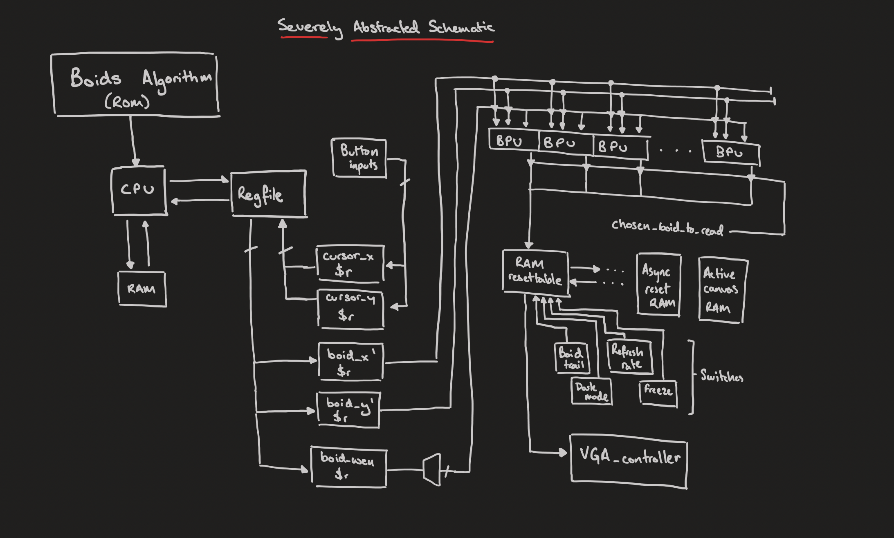
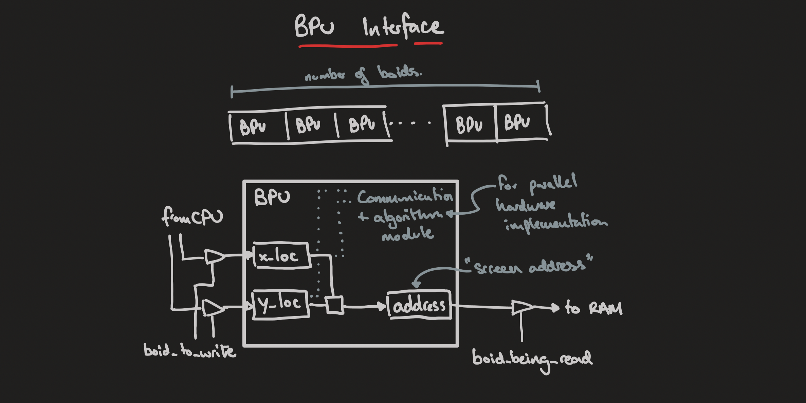
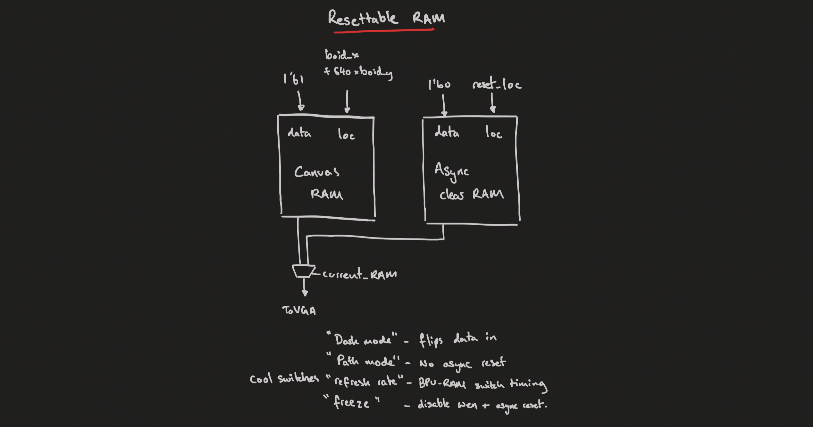

### Hardware Layout
Our initial plan was to create the boids algorithm using parallel computation, and so our hardware is laid out in a way to support GPU-like computation of the boids, where each boid has its own "BPU" - Boid Processing Unit. The layout allows for parallel computation and updates of the boids, with each BPU being responsible for a single boid.

In order to comply with the final project's requirements we had to retrofit our 5-stage pipelined CPU into our computational scheme, moving from computing from parallel threads to computing sequentially within our CPU. This meant sacrificing the computational speed we would get from the BPU implementation and in return having to use less memory and significantly less extensive hardware structures that could have reached the limits of our FPGA's capabilities.

Below is a simplified overview of our hardware layout, where we created all the components being used.

- **ROM**: Where we stored our compiled algorithm, in machine code for our specific design of the CPU
- **CPU**: Our custom built 5-stage pipleined, bypassing and hazard detecting 32-bit processor
- **RAM**: This is our main memory, used for storing data during CPU computation
- **Regfile**: Register file which has 32 32-bit registers, with `$r23-$r28` being reserved for communication between the CPU and the rest of the hardware components
    - `$r23`: Used to communicate the x_pos of the user controlled repulsor boid
    - `$r24`: Used to communicate the y_pos of the user controlled repulsor boid
    - `$r25`: Indicates when all boids have been updated in their BPUs, signifying the end of a frame
    - `$r26`: Holds the updated x_pos of the current boid being updated
    - `$r27`: Write enable signal that is either -1 implying write disabled or has the index of the boid being updated
    - `$r28`: Holds the updated y_pos of the current boid being updated

- **Button Inputs**: Used to control the "scary" boid which repulses other boids around it
- **BPUs**: Boid Processing Units, each of which is responsible for a single boid
- **Resettable RAM**: Custom implementation of RAM to allow for pixel updating only to the locations of the boids, and so a much faster refresh rate for the VGA
- **Switches**: Switches allow the user to manipulate the memory and display interfaces, allowing for different effects, such as dark mode, boid trail modes etc
- **VGA Controller**: Custom VGA controller that reads from our implementation of RAM and displays the boids on the screen

### BPU Interface
As our inital plan was for parallel computation, we built a large parallel array of structures we coined "BPUs" - "Boid Processing Units". There will be a single BPU per boid, and therefore there will be an additional instance of hardware needed anytime we want to add a new boid to the simulation.

A BPU module has two inputs and a single output. It takes in the computed x and y positions of the boid from the CPU using a tristate implementation (latched to register 27 which provides information about which boid to write to). The output is the address on the VGA display at which the boid should be drawn (which is calculated within the BPU).

Inside the BPU, we have registers that store the x_loc and y_loc of the boid. Then there is a computation block that efficiently computes the address of the boid on the VGA display. This is where the parallel computation would have taken place, but due to the constraints of the final project, we had to move this computation to the CPU - the general structure of this computation is explained in the "Parallel BPU computation" section.

### Canvas RAM

One of the bottlenecks we ran into was the inability to refresh our screens fast enough for our computation. This is especially visible when we have a large number of boids on the screen. Traditionally, the VGA display would work by going sequentially through each pixel and updating it. The update would consist of checking whether any of the N boids are in that pixel and then updating the pixel accordingly (as we not only have to check for the presence of a boid, but also the lack of a boid to remove the boid from the screen).

To solve this issue, we created a custom RAM module that has two instances of RAMs. We named these RAMs "canvas" and "async clear" for reasons that will hopefully become clear. The general structure of this module can be seen below.

The "canvas" RAM is essentially an empty, cleared RAM. This allows us to only write to the locations of the boids, and not have to worry about clearing the screen every frame, allowing for a much faster refresh rate. 

The async clear RAM is used to clear the screen asynchronously. We do this by asynchronously writing "0s" to this RAM at the same time as the "canvas" RAM is interacting with the VGA screen and BPUs.

This gives us the ability to switch which is the "active" RAM (ie the RAM that is being read from by the VGA controller) every time the BPUs are done updating. 

Therefore, we can forgo the need to check every pixel everytime we need to update a frame, and can essentially start with a blank canvas on every new frame. This means for every frame, if we have N boids, we only have to do N computations & writes to the "canvas" RAM, rather than num_pixels * N computations & writes - a significant speedup.

We also have some switches that alter the behaviour of our RAM, leading to some interesting effects, summarised below:

- **Switch 0**: Dark mode - screen is inverted, leading to a dark background with light boids, this makes the boids more visible
- **Switch 1**: Boid trail mode - boids leave a trail behind them, this is done by disabling the async resettable RAM and only writing to the canvas RAM
- **Switch 2**: Freeze mode - boids are frozen in place, this is done by disabling the write enable signal to the RAMs
- **Switch 3**: Faster refresh rate - reduces the time between frames, leading to a faster refresh rate, however this can lead to flickering

### VGA

The VGA display works asynchronously to all the other components of the system. The VGA controller takes in a reference to the current RAM being displays and simply goes pixel by pixel to update the VGA display. The VGA controller also runs a check to see if the current pixel should have the user controlled repulsor boid drawn on it, and if so, it overwrites the RAM's data and displays the repulsor boid.

### Timing of components

Most of our components were run at a clock rate of 50MHz, with the exception of our VGA controller which was run at 25MHz. The way our components were made in a way that there were distinct zones, and we could have run the system in a way that each zone was run at a different clock rate. The main distinct zones were the CPU-RAM-Regfiles, the BPUs and the custom RAM-VGA controller. THe interfaces between these zones could be at the same clock rate, but the internal workings of each zone could be at a different frequencies (this is something that could be optimized in the future).

### Iverilog

<iframe width="100%" height="auto" src="https://www.youtube.com/embed/JwafiWxrD0A?si=djwfJjYUTPSUsaAc" title="Demo Video" frameborder="0" allow="accelerometer; autoplay; clipboard-write; encrypted-media; gyroscope; picture-in-picture; web-share" referrerpolicy="strict-origin-when-cross-origin" allowfullscreen></iframe>

## Future Work
What improvements you would make / new features you would add if you had more time

### Compiler Optimization

### Parallel Hardware Implementation
- mealy FSM 

## Media
Pictures of your project

## Bloopers (Challenges)
- Wasted 3/4 hours not realizing the provided processor testbench only supported 512 lines of execution
- Waster 5/6 hours because we didn't read li documentation and didn't realize that the li instruction only supported 16 bit immediate values (this created a disparity between simulated MIPS and hardware MIPS)
- Our MIPS assembler doesn't support space allocation with '.space' so we had to manually allocate space in more_compiles.py
- MIPS default \$sp is \$30. We had some wacky issues with overflows because exceptions would move the stack reference (not good)
- Turns out trying to find one pixel on a VGA screen is very hard, spent a lot of hours thinking our system was broken when we simply could not see
- The VGA screens work very strangely, and actually shut off if you provide them a value all the time. You actually need to have an "active" signal that tells you when to update the screen (ie when there is a new frame), if you provide any information whatsoever at any other time the screen will fail

